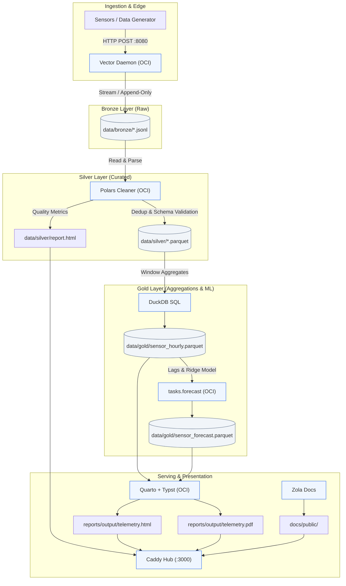

# Cupella

A modern, containerized **Medallion Architecture** telemetry pipeline designed for edge sensor ingestion, high-performance data curation, predictive modeling, and automated executive reporting.



---

## Architectural Highlights

* **Bronze (Raw Ingestion):** Scalable ingestion powered by [Vector](https://vector.dev). Buffers streaming HTTP payloads directly into append-only JSONL files with zero transformation overhead.
* **Silver (Curation & Validation):** High-throughput data hygiene with [Polars](https://pola.rs). Enforces schema strictness, deduplication, timestamp normalization, and outlier removal before serializing into compressed Apache Parquet. Automatically outputs an HTML audit report.
* **Gold (Analytical Modeling):** [DuckDB](https://duckdb.org) executes complex rolling window aggregations, followed by multi-step lag feature extraction and Ridge regression forecasting with [scikit-learn](https://scikit-learn.org).
* **Serving & Reports:** High-fidelity scientific and executive reporting compiled from [Quarto](https://quarto.org) to responsive HTML and modern, publication-ready PDF documents via [Typst](https://typst.app).
* **Documentation & Gateway:** Lightweight project documentation built with [Zola](https://www.getzola.org) (featuring offline Mermaid.js support) served alongside pipeline artifacts via a unified [Caddy](https://caddyserver.com) reverse proxy.

---

## Tech Stack

| Layer | Tools | Description |
| --- | --- | --- |
| **Ingestion** | Vector | High-performance log and telemetry stream collector |
| **Data Engine** | Polars, DuckDB, PyArrow | Multi-threaded columnar data wrangling & OLAP engine |
| **ML Engine** | scikit-learn, SciPy | Ridge regression and time-series forecasting |
| **Environment** | Python 3.12, `uv` | Blazing-fast dependency resolution and virtual environments |
| **Reporting** | Quarto, Typst | Automated data science reporting (HTML & Typst PDF) |
| **Documentation** | Zola, Mermaid.js | Fast static-site docs with local diagram rendering |
| **Serving** | Caddy | Minimal local webserver and reverse proxy (`:3000`) |
| **Orchestration** | `just`, Podman / Docker | Declarative task automation and container isolation |

---

## Directory Layout

```text
.
├── containers/             # Containerfiles for pipeline components
│   ├── bronze/             # Vector ingestion daemon
│   ├── report/             # Quarto + Typst runtime
│   └── tasks/              # Unified Python/uv worker runtime
├── data/                   # Git-ignored pipeline artifacts
│   ├── bronze/             # Raw JSONL files
│   ├── silver/             # Curated Parquet & audit report
│   └── gold/               # Aggregated & forecast Parquet
├── docs/                   # Zola documentation site
│   ├── content/
│   ├── static/js/          # Offline Mermaid.js assets
│   └── templates/
├── gold/                   # Gold analytical tasks
├── silver/                 # Silver curation tasks
├── reports/                # Quarto (.qmd) report definitions
├── pyproject.toml          # Central project dependency spec
├── uv.lock                 # Deterministic dependency lockfile
└── Justfile                # Project command orchestrator

```

---

## Prerequisites

* **Task Runner:** [`just`](https://github.com/casey/just)
* **Container Engine:** [`podman`](https://podman.io/) (or `docker`)
* **Python Toolchain (optional for host execution):** [`uv`](https://github.com/astral-sh/uv)

---

## Quick Start

All operations are managed through `just`. Run `just --list` to view available recipes.

### 1. Build Container Images Locally

```bash
just build-all

```

### 2. Run the End-to-End Pipeline

Execute the full pipeline sequentially—from stream generation to curated analytical reports:

```bash
# 1. Start Bronze ingestion daemon
just bronze

# 2. Simulate streaming telemetry (200 records via HTTP)
just stream-data

# 3. Gracefully flush vector buffers
just bronze-stop

# 4. Curate data into Silver Parquet
just silver

# 5. Extract window aggregates and train ML forecast models
just gold

# 6. Render Quarto & Typst reports
just report

```

Or run the pre-configured automated integration sequence:

```bash
just test

```

### 3. Serve Reports & Documentation

Spin up the local Caddy file server to browse pipeline reports and architecture documentation:

```bash
just serve

```

Open [http://localhost:3000](http://localhost:3000) to inspect:

* `/docs/` – Zola Documentation with interactive Mermaid diagrams.
* `/silver/report.html` – Data curation and quality audit.
* `/reports/telemetry.html` – Interactive analytical dashboard.
* `/reports/telemetry.pdf` – Generated Typst document.

---

## OCI Containers & CI/CD

Pre-built images are published to the **GitHub Container Registry (GHCR)**:

* `ghcr.io/<owner>/cupella-bronze:latest`
* `ghcr.io/<owner>/cupella-tasks:latest`
* `ghcr.io/<owner>/cupella-report:latest`

### Local CI Emulation with `act`

Pipeline builds and end-to-end integration workflows can be tested offline without pushing to GitHub:

```bash
# Verify container builds
just ci-containers

# Run full pipeline E2E test workflow
just ci-test

```

---

## License

MIT License. See [LICENSE](https://www.google.com/search?q=LICENSE) for details.
