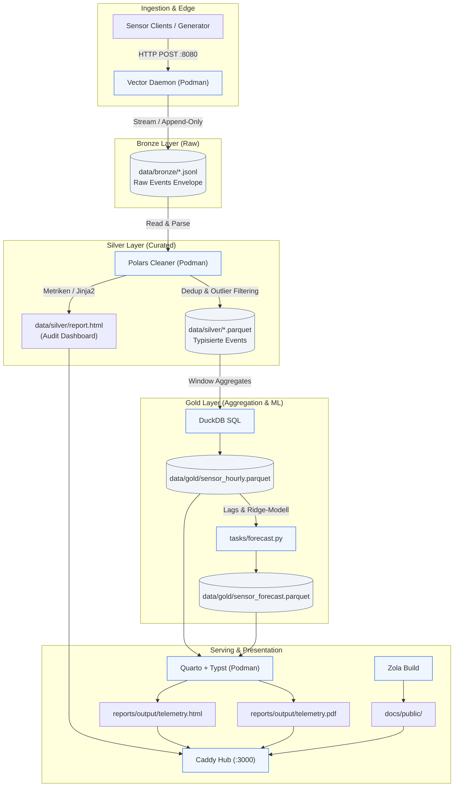

+++
title = "Architektur & Pipeline-Doku"
+++

Willkommen bei **Cupella**.

### Medallion Flow
1. **Bronze:** Unstrukturierte JSON-Events via Vector HTTP-Server.
2. **Silver:** Bereinigung, Typisierung und Parquet-Deduplizierung via Polars.
3. **Gold:** Verdichtung mit DuckDB & 3h-Inferenz.
4. **Reporting:** Reproduzierbare HTML- & PDF-Artefakte via Quarto & Typst.

